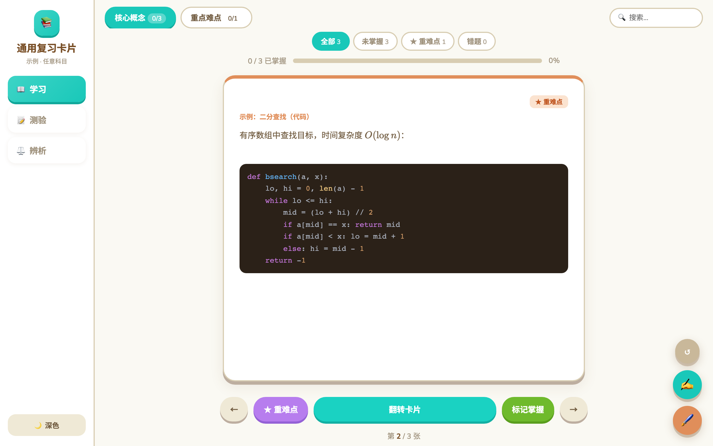
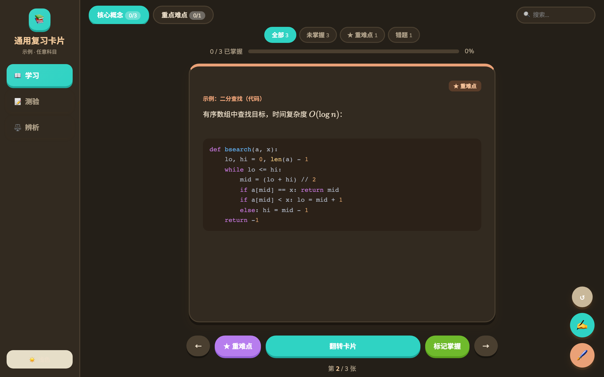

# 📚 exam-flashcard-builder

> A Claude Code **Skill** that turns study materials for **any subject** into a self-contained, offline-capable interactive flashcard review system — with auto difficulty grading, quizzes, confusable-point comparison, split-screen dictation, math formulas and code highlighting.

上传任意科目的资料（PDF / DOCX / PPTX / Markdown / TXT / 图片），自动蒸馏重难点、分级，并生成一个**单文件 HTML 复习系统**。换科目只需替换数据，界面始终如一。

<p align="center">
  
</p>

---

## ✨ 生成的系统包含

| 功能 | 说明 |
|------|------|
| 📖 学习模式 | 3D 翻转卡片，按难度分级（基础 / 进阶 / 重难点）|
| 📝 测验模式 | 卡片自动生成单选题，即时判分，答错进**错题本** |
| ⚖️ 辨析模式 | 易混知识点**并排对比**（自动识别 + 可手动指定）|
| ✍️ 默写练习 | 页面内**左右分屏**：左为可翻转卡片、右为默写区；切卡自动清空 |
| 🧮 公式 + 代码 | `$LaTeX$` 数学公式（KaTeX）+ 代码语法高亮（highlight.js）|
| ⭐ 难度分级 | 自动 / 手动标注，支持按难度筛选 |
| 🌙 深色模式 | 暖色夜间主题 |
| 📐 自适应布局 | 左侧边栏导航、整页不滚动、右下角浮动工具、移动端友好 |
| 💾 进度持久化 | localStorage 本地保存掌握/错题/主题 |

| 代码高亮 | 测验 | 深色模式 |
|:---:|:---:|:---:|
|  |  |  |

> 界面风格参考 [Animal Island UI](https://github.com/guokaigdg/animal-island-ui)（Animal Crossing 风）。

---

## 🚀 安装

将本仓库克隆到 Claude Code 的 skills 目录：

```bash
git clone https://github.com/YanyingWei1997/exam-flashcard-builder.git \
  ~/.claude/skills/exam-flashcard-builder
```

之后在 Claude Code 中说「**帮我把这份资料做成复习卡片**」「**用这门课的资料做个复习系统**」即可触发。

## 🧠 工作流

1. **解析资料** —— 读取 PDF / DOCX / PPTX / MD / TXT / 图片
2. **重难点分级** —— 依据考纲/真题/AI 判断/联网检索，标注 基础/进阶/重难点
3. **整理卡片** —— 按模块分牌组，一卡一知识点（支持公式与代码）
4. **扩展练习** —— 自动选择题 + 易混辨析（也可精编题库 `quizBank` / 易混组 `confusables`）
5. **生成 HTML** —— 替换模板占位符，输出 `<科目>_复习卡片系统.html`

## 📁 结构

```
exam-flashcard-builder/
├── SKILL.md                          # Skill 定义与工作流
├── assets/
│   └── flashcard-template.html       # 完整模板引擎（替换占位符即用）
├── references/
│   ├── card-data-spec.md             # 卡片 / 题库 / 易混组数据格式（含公式、代码写法）
│   └── distillation-workflow.md      # 解析、分级、生成、验证流程
└── screenshots/
```

## 🛠️ 技术

纯原生 HTML / CSS / JS，单文件零依赖；公式 [KaTeX](https://katex.org/)，代码高亮 [highlight.js](https://highlightjs.org/)（CDN，离线降级为纯文本）。

## 📄 License

MIT
